# Отчет по лабораторным работам 
**Студент:** Зиневич Роман  
**Группа:** ЭВМб-23-1  

## Лабораторная работа 1
**Вариант 4:** 

### Практическая часть
1. Что любит Бет:
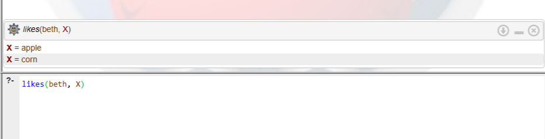

2. Проверка, любит ли Мэри кукурузу:
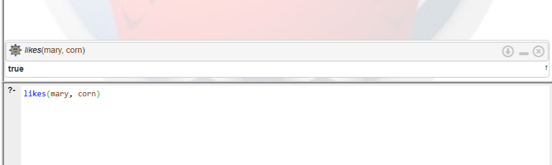

3. Какие фрукты известны системе:
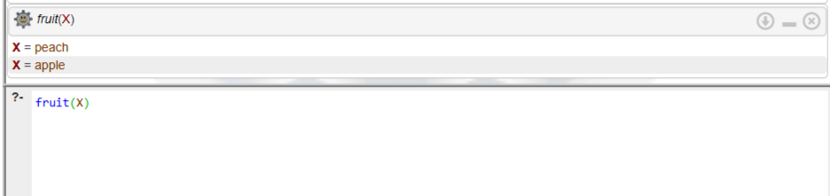

4. Какого цвета персик:
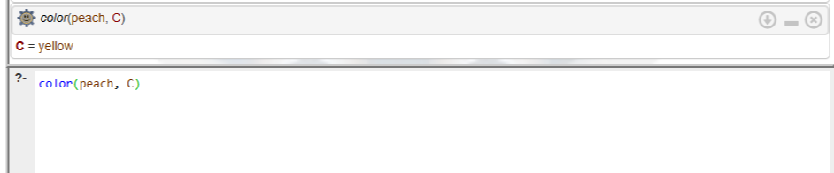

**Итог:** Освоен базовый синтаксис Пролога. Реализованы логические правила с конъюнкцией условий.

## Лабораторная работа 2
**Вариант 17:** Добавить элемент в конец списка.

**Декларативная интерпретация:** Добавление элемента в пустой список дает список из этого одного элемента. Иначе - результат состоит из старой головы и хвоста, к которому добавлен элемент.  
**Процедурная интерпретация:** Программа рекурсивно проходит до конца списка (отделяя голову), а затем прикрепляет новый элемент к пустому хвосту.

### Практическая часть
1. Добавление элемента в заполненный список:
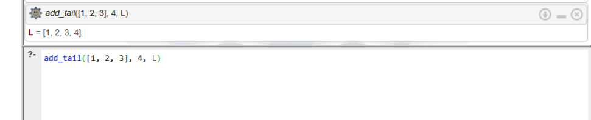

2. Добавление элемента в пустой список:
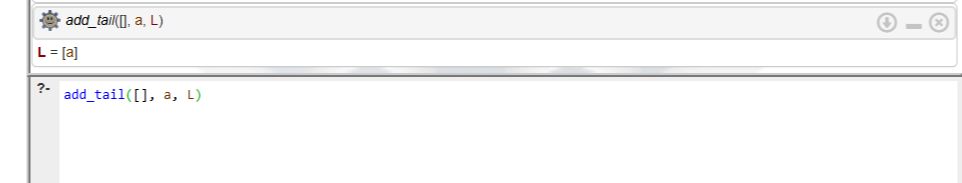

**Итог:** Изучена рекурсивная обработка списков, освоена работа с конструкцией `[H|T]`.

## Лабораторная работа 3
**Вариант 11:** Кинотеатры и фильмы.

### Практическая часть
1. Первичная загрузка тестовой базы данных:
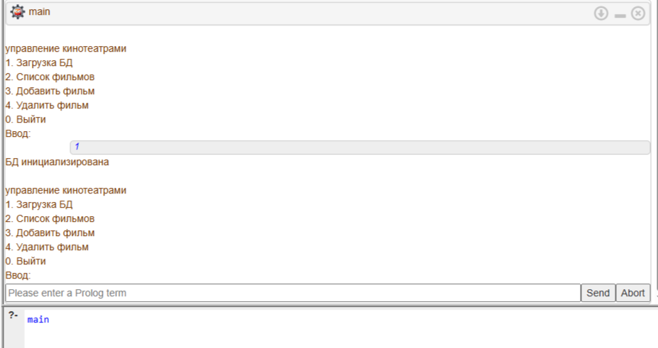

2. Вывод доступных фильмов:
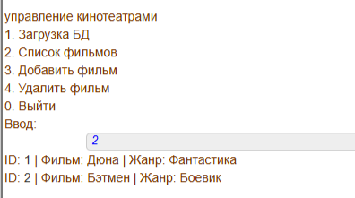

3. Добавление новой записи фильма:
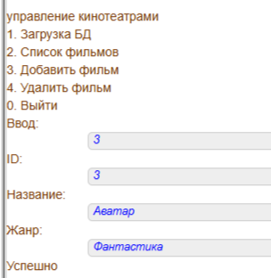

4. Каскадное удаление (фильм + сеансы):
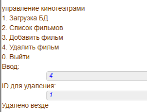

5. Выход из программы:
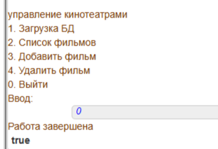

**Итог:** Реализовано консольное интерактивное меню. Опробованы динамические предикаты и функции `assertz`, `retractall` для изменения состояния памяти.

## Лабораторная работа 4
**Вариант 5:** Решить задачу о выполнимости логической функции `x1*x2*!x3 v !x1*x2*x3`.

### Практическая часть
1. Вывод всех истинных наборов переменных:
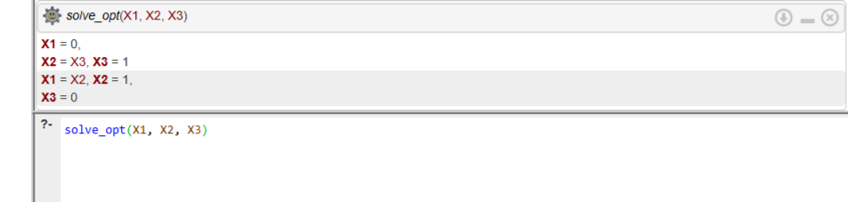

2. Трудоемкость полного перебора:
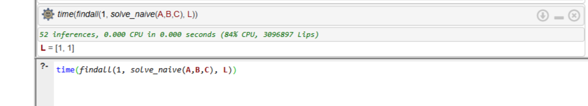

3. Трудоемкость оптимизированного перебора:
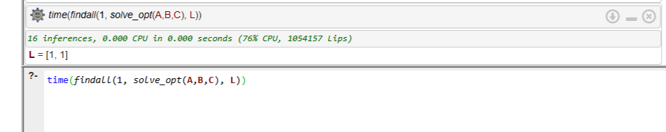

**Итог:** Анализ формулы показал, что переменная `x2` всегда равна 1, а `x1` и `x3` имеют противоположные значения. Применение этого математического факта сократило пространство поиска и снизило количество логических выводов (inferences).

## Лабораторная работа 5
**Задание:** Создать ЭС на тему "Выбор домашнего питомца".

### Практическая часть
1. Ветвь 1 (Пушистый и нужно выгуливать / Собака):
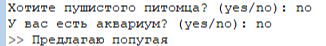

2. Ветвь 2 (Пушистый и без выгула / Кошка):
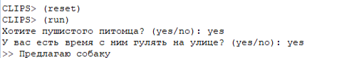

3. Ветвь 3 (Не пушистый и без аквариума / Попугай):
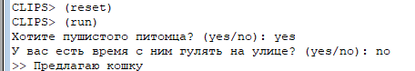

4. Ветвь 4 (Не пушистый и есть аквариум / Рыбки):
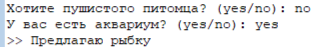

5. Срабатывание правила защиты от некорректного ввода:
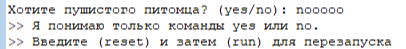

**Итог:** Изучена среда CLIPS. Написаны продукционные правила `defrule`, 4 логические ветки и правила, перехватывающие неверные ответы (`~yes&~no`).
